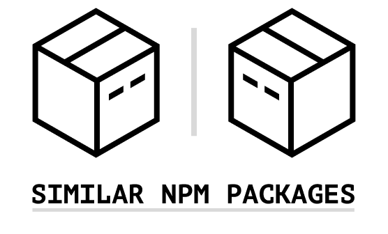

<div align="center">
  <a href="https://bundlephobia.com/">
    
  </a>
</div>

<div align="center">
  Similar packages suggestions for the NPM ecosystem.<br />
  <a href="https://bundlephobia.com/">Bundlephobia</a> team project
</div>

## How to add a package or category

If you want to help us improve the registry you could [create a new issue](https://github.com/pastelsky/similar-npm-packages/issues/new) describing a suggested package/category or change `src/similar-npm-packages.ts` file yourself with a pull request.

Qualitative over quantitative. Before contributing you should know that we keep suggestions limited to 5 packages in all categories. If you're going to add a package to a "crowded" category, be ready to explain your suggestion. Qualitative over quantitative.

## Install

```
npm install similar-npm-packages --save
```

## Usage

```js
import { categories } from "similar-npm-packages";
console.log(categories.cookie);
```
